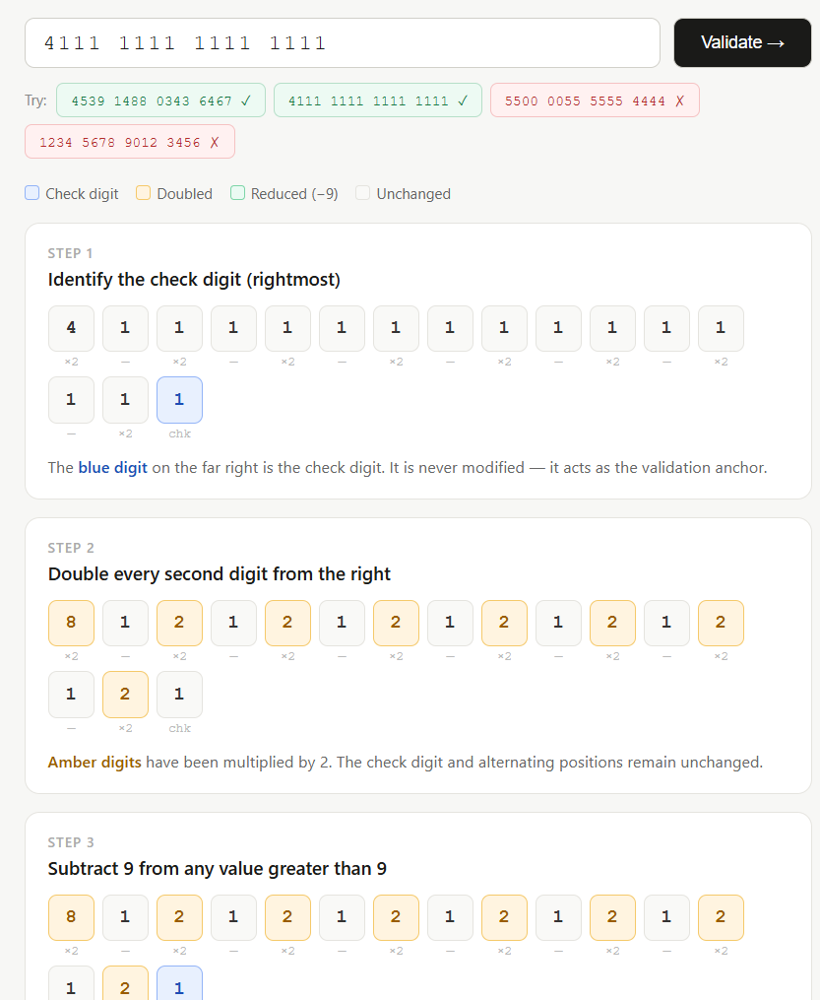
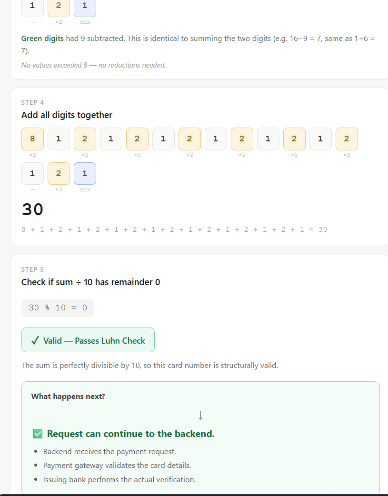

# Luhn Algorithm Visualizer

An interactive visualization of the **Luhn Algorithm** that demonstrates how credit card numbers are validated step by step.

This project was created as a learning resource to help developers understand **how the Luhn checksum works**, rather than simply seeing the final result.

👉 **Live Demo:** `https://nayan-kunwar.github.io/luhn-algorithm-visualizer/`

---

## Preview



The visualizer walks through every stage of the Luhn algorithm:

* 🔹 Identify the check digit
* 🔸 Double every second digit from the right
* 🟢 Subtract 9 from values greater than 9
* ➕ Calculate the total sum
* ✅ Determine whether the card number passes the Luhn check

It also includes:

* Interactive card number input
* One-click sample card numbers
* Color-coded visualization
* Step-by-step explanations
* Instant validation

---

## Why This Project?

Many developers assume that the Luhn algorithm verifies whether a credit card actually exists.

It doesn't.

The Luhn algorithm simply checks whether a card number is **structurally valid** by applying a mathematical checksum.

This project visualizes every step of that process so you can understand **why** a card passes or fails the validation.

---

## How the Algorithm Works

The visualizer follows these five steps:

1. Identify the **check digit** (the rightmost digit).
2. Starting from the right, **double every second digit**.
3. If doubling produces a value greater than **9**, subtract **9**.
4. Add all the digits together.
5. If the total is divisible by **10**, the card number passes the Luhn check.

---

## Example

Input

```text
4539 1488 0343 6467
```

Result

```text
✓ Valid — Passes Luhn Check
```

---

## Technologies Used

* HTML5
* CSS3
* Vanilla JavaScript

No frameworks or external libraries are required.

---

## Running Locally

Clone the repository:

```bash
git clone https://github.com/nayan-kunwar/luhn-algorithm-visualizer.git
```

Move into the project:

```bash
cd luhn-algorithm-visualizer
```

Open `index.html` in your browser.

Or use VS Code Live Server for the best development experience.

---

## Related Article

This project accompanies my Medium article:

> **[Luhn Algorithm Explained: How Credit Card Validation Really Works](https://medium.com/@nayankunwar678/luhn-algorithm-explained-how-credit-card-validation-really-works-96e108e13002?sharedUserId=nayankunwar678)**

The article explains:

* What the Luhn algorithm is
* Why payment systems use it
* How the checksum works
* Why a fake card number can still pass the Luhn algorithm

---

## ⭐ Support

If you found this project helpful, consider giving it a **⭐ Star** on GitHub.
